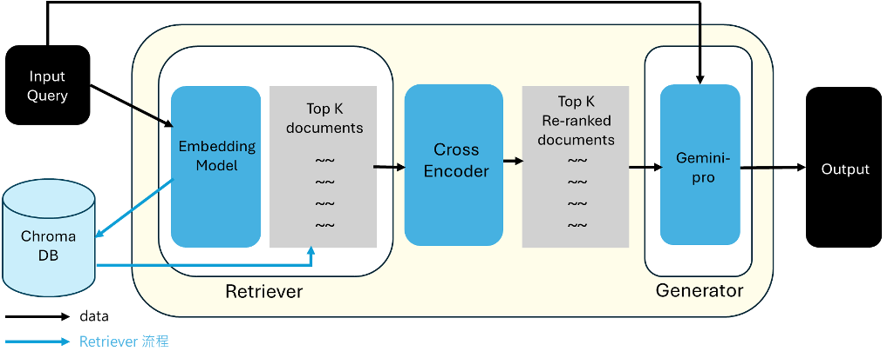

# 🤖 繼往聖絕學：基於 RAG 技術的唐詩生成系統  
### SageAI: Chinese Ancient Poetry Generation System Based on RAG

## 大三專題研究 (Junior Research Project)

本專題結合 **古典文學研究** 與 **生成式人工智慧技術**，設計並實作一套能夠理解與生成唐詩內容的智慧系統。透過 **Retrieval-Augmented Generation (RAG)** 架構，使大型語言模型在生成內容時能夠參考真實的古典文學資料，提升生成品質與文化語境的準確性。

---

## 📍 設計理念 (Design Motivation)

在現代社會中，古文常被認為艱澀難懂，與當代生活距離遙遠。這樣的隔閡使許多古聖先賢的思想與經典文學作品逐漸不易被理解，甚至面臨被忽視的風險。

本專題希望透過 **古典文學** 與 **生成式 AI** 的結合，打造一個能夠理解、分析並生成唐詩的智慧導師系統，讓學生、研究者、文學愛好者以及一般大眾，都能以更自然、互動的方式接觸中國古代文學，進一步為古學的傳承盡一份心力。

---

## 📍 摘要 (Abstract)

本專題透過結合 **古典文學資料** 與 **現代生成式 AI 技術**，建構一個能夠根據使用者需求進行唐詩生成的智慧系統。

系統核心採用 **Retrieval-Augmented Generation (RAG)** 架構，使大型語言模型在生成內容時能夠參考外部知識庫，以提升回覆的準確性、文化背景的一致性，以及詩詞風格的表現力。

在系統實作上，我們：

- 使用 **自行微調的 Embedding Model** 進行古文語意向量化 
- 使用 **ChromaDB** 建立向量資料庫，儲存唐詩文本的語意向量  
- 採用 **Gemini Pro** 作為主要的 Large Language Model (LLM)，LLM會參考檢索回的文本進行唐詩生成。
- 結合 **Cross-Encoder** 對檢索結果進行重排序 (re-ranking)，提升檢索效果  
- 融入 **Advanced RAG** 相關概念，進一步提升整體生成品質  

透過上述方法，本專題期望建立一套兼具文化內涵與技術深度的唐詩生成系統，探索生成式 AI 在古典文學傳承上的應用潛力。

---

## 📍 系統架構 (System Architecture)

---

## 📍 使用模型 (Models)

### Embedding Model
`RinaChen/Guwen-nomic-embed-text-v1.5`
此模型針對 **古文與白話文語料** 進行訓練，能更有效捕捉古典詩詞中的語意特徵與語境資訊。

### Cross Encoder
`RinaChen/ms-marco-MiniLM-L-6-v2_finetune_cross_encoder`

---

## 📍 技術架構 (Tech Stack)

- **LLM**: Gemini Pro  
- **Vector Database**: ChromaDB  
- **Embedding Model**: RinaChen/Guwen-nomic-embed-text-v1.5  
- **Retrieval Enhancement**: Cross-Encoder  
- **Framework**: Retrieval-Augmented Generation (RAG)  
- **Optimization Strategy**: Advanced RAG  
